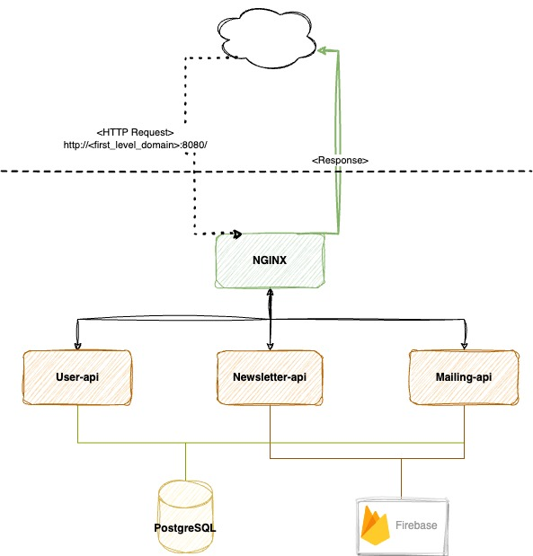

# Newsletter app in GO (Albert Mírek, Ondřej Pišl)

### Infrastucture

## Endpoints
To access endpoint the request travels through Nginx reverse proxy  
nginx starts at `http://localhost:8080`

To access endpoints of other services you need to supply name of desired service (`user-api`, `newsletter-api`, `mailing-api`) and desired endpoint of the api

*For example*
`http://localhost:8080/user-api/v1/ping`

### APIS docs
Each API has its own documentation, which can be found in `cmd/{api-name}/ApiSpec.md`

[User-api](cmd/user-api/ApiSpec.md)  
[Newsletter-api](cmd/newsletter-api/ApiSpec.md)  
[Mailing-api](cmd/mailing-api/ApiSpec.md)

## SETUP
The application should be developed through docker. Each API uses air library, whic enables live reload upon file change. To compose containers, this project uses docker-compose

### First time setting up
Whole project should be ran from docker to be sure that code runs same on all machines.  

`make all`  
Builds all the containers for each api --> starts the containers --> migrates up (loads up the db schema)

### Developing
It should be sufficient to run `make run`  (which acts as docker-compose up, essentialy starting your containers so that you can see all the logs and output right in the console, thanks you live reload it comes in handy in terms of developing and debugging)

### DB
There are 2 make commands for migrations  

`make migrate-up` Loads up the schema

`make migrate-down` Drops all the tables

## Inspecting Database
Project uses PostgresSQL as a DB. There is also adminer specified for the project which can be accesed on `localhost:8085`

For local purposes input these values when loggin in adminer 
- **system**: `PostgreSql`
- **server**: `db`
- **login**: `user`
- **password**: `password`

## ENV variables
Please check your Teams messages I have sent you all variables that you need to run the project

## Production
This project is ran on DigitalOcean droplet.

The url for accessing the droplet is: `http://209.38.200.216`

